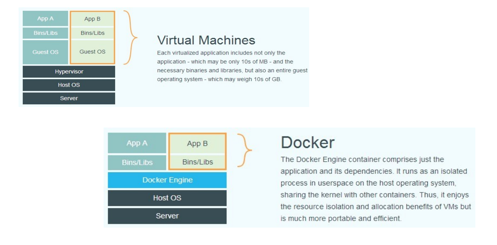
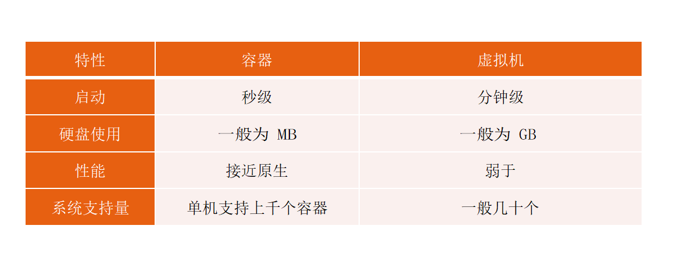
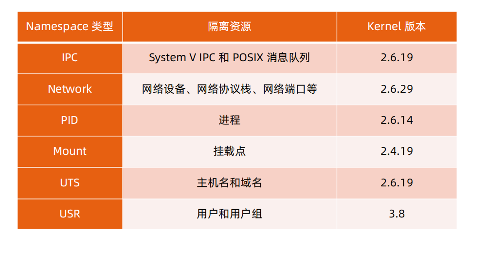
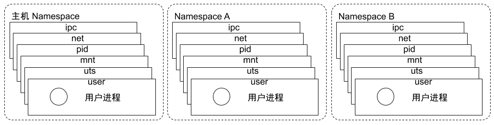
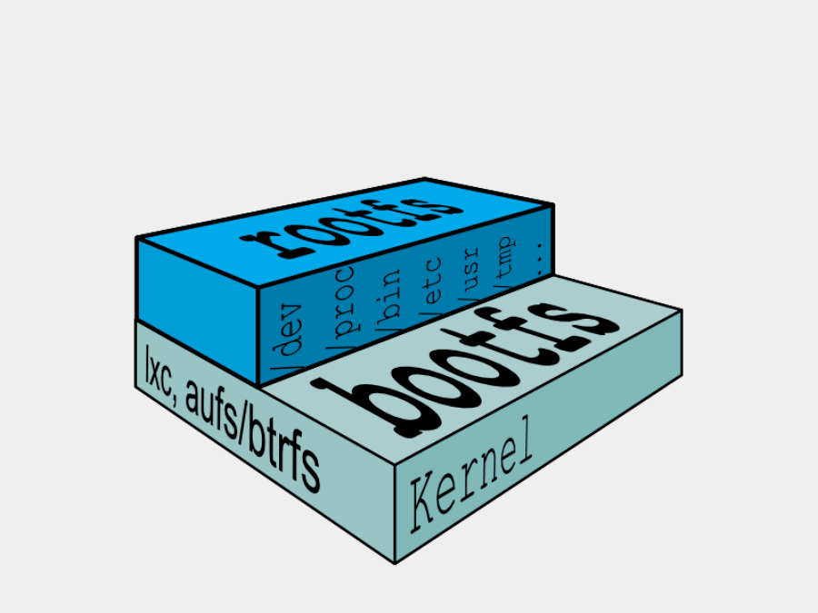
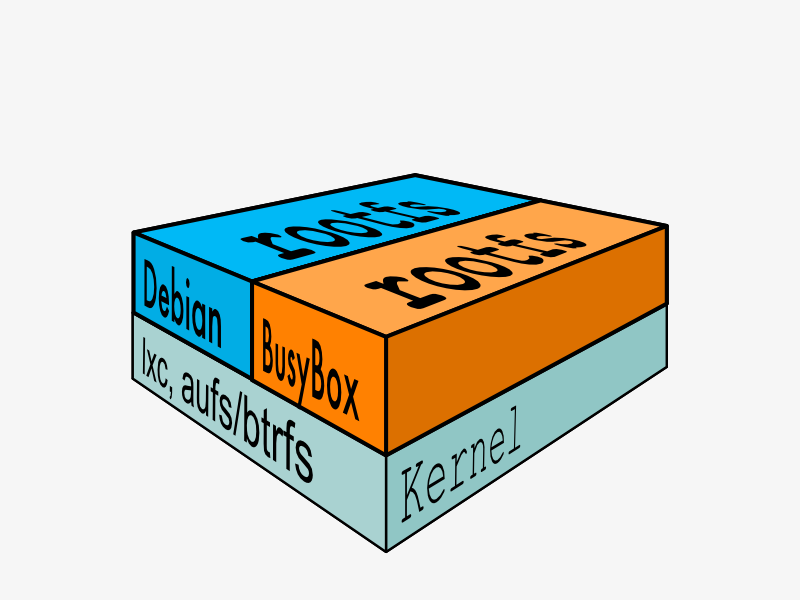

# 容器


## 虚拟机与容器运行态对比




## 性能对比



## 为什么要用Docker

1. 更高效的利用系统资源
2. 更快的启动时间
3. 一致的运行环境
4. 持续交付和部署
5. 更轻松的迁移
6. 更轻松的维护和扩展

.....


## 容器操作

- 启动

  ```text
  docker run
  	-it 交互
  	-d 后台运行
  	-p 端口映射
  	-v 磁盘挂载
  ```

- 启动已经终止的容器

  ```text
  docker start <containerid>
  ```

- 停止容器

  ```text
  docker stop <containerid>
  ```

- 查看容器进程

  ```text
  docker ps
  ```

- 查看容器细节

  `docker inspect`是docker客户端的原生命令，用于查看docker对象的底层基础信息。包括容器的id、创建时间、运行状态、启动参数、目录挂载、网路配置等等。另外，该命令也可以用来查看docker镜像的信息。

  ```text
  docker inspect <containerid>
  ```

- 进入容器

  ```text
  docker exec -it <containerid> bash
  ```

- 拷贝文件至容器内

  ```text
  docker cp file <containerid>:/file-to-path
  ```

- nsenter介绍

## 概念介绍

容器

仓库

镜像

## 容器主要特性


## Namespace

- Linux Namespace是一种Linux Kernel提供的资源隔离方案
  - 系统可以为进程分配不同的Namespace
  - 保证不同的Namespace资源独立分配、进程彼此之间互相隔离

### 隔离性





#### Pid namespace

• 不同用户的进程就是通过 Pid namespace 隔离开的，且不同 namespace 中可以有相同 Pid。 

• 有了 Pid namespace, 每个 namespace 中的 Pid 能够相互隔离。

#### net namespace

• 网络隔离是通过 net namespace 实现的， 每个 net namespace 有独立的 network devices, IP addresses, IP routing tables, /proc/net 目录。 

• Docker 默认采用 veth 的方式将 container 中的虚拟网卡同 host 上的一个 docker bridge: docker0 连接在一起

#### ipc namespace

• Container 中进程交互还是采用 linux 常见的进程间交互方法 （interprocess communication – IPC）, 包括常见的信号量、消息队列和共享内存。 

• container 的进程间交互实际上还是 host上 具有相同 Pid namespace 中的进程间交互，因此需要在 IPC资源申请时加入 namespace 信息 - 每个 IPC 资源有一唯一的 32 位 ID。

#### mnt namespace

mnt namespace 允许不同 namespace 的进程看到的文件结构不同，这样每个 namespace 中的进程所看

到的文件目录就被隔离开了。

#### uts namespace

UTS(“UNIX Time-sharing System”) namespace允许每个 container 拥有独立的 hostname 和domain name, 使其在网络上可以被视作一个独立的节点而非 Host 上的一个进程。

#### user namespace

每个 container 可以有不同的 user 和 group id, 也就是说可以在 container 内部用 container 内部的用户执行程序而非 Host 上的用户。

## Cgroups

- Cgroups(Control Groups)是linux下用于对一个或一组进程进行资源控制和监控的机制
- 可以对GPU使用时间、内存、磁盘I/O等进程所需资源进行限制
- 不同资源的具体工作由相应的Cgroup子系统（Subsystem）来实现
- 针对不同类型的资源限制，只要将限制策略在不同的子系统上进行关联既可

  

## 文件系统

### Linux文件系统

典型的 Linux 文件系统组成：

• Bootfs（boot file system） 

​	Bootloader - 引导加载 kernel， 

​	Kernel - 当 kernel 被加载到内存中后 umountbootfs。 

• rootfs （root file system） 

​	/dev，/proc，/bin，/etc 等标准目录和文件。 

​	对于不同的 linux 发行版, bootfs 基本是一致的，但 rootfs 会有差别。





### Union FS

- docker在运行容器镜像的构建，实现的底层是通过分层构建联合挂载实现。一个功能在 这样使我们以后镜像分发没那么庞大了
  每一层镜像都是只读的，在每一层联合挂载的顶层附加一个新层可读写


